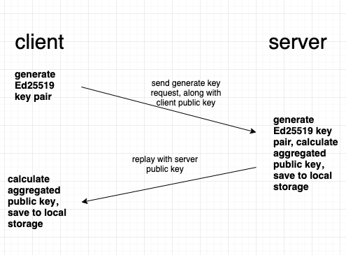
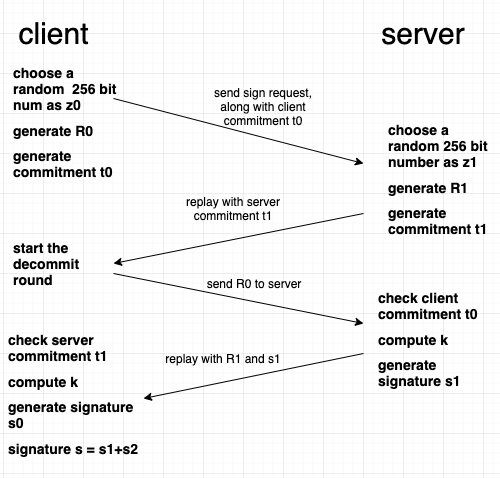

## Two party EdDSA signature scheme


### 1. The Scheme

Public parameters:

* G: group defined by curve25519
* q: order of the group
* B: generator of the group


1. Key generation:
   * Each party choose a random secret key `sk` from the field and hashes it with SHA512 to get an extended private key`(x||prefix)`:
     * h = SHA512(sk)
     * private key x = h[0:32] with bits<sub>255</sub> = 0, bits<sub>254</sub> = 1 and bits<sub>2</sub> = bits<sub>1</sub> = bits<sub>0</sub> = 0
     * prefix = h[32:64]
     * public key A = xB
2. Key aggregation:
   * Aggregated public key `apk` = hash(A<sub>0</sub>, A<sub>1</sub>) * A<sub>0</sub> + hash(A<sub>1</sub>, A<sub>0</sub>) * A<sub>1</sub>
3. Signing:
   * Round1: Each party:
     * choose a random 256 bits number z<sub>i</sub>
     * r<sub>i</sub> = SHA512(prefix<sub>i</sub> || M || z<sub>i</sub>) where prefix<sub>i</sub> is the prefix of i's extended private key and M is the message hash
     * R<sub>i</sub> = (r<sub>i</sub> mod q)B
     * calculate commitment t<sub>i</sub> = hash(R<sub>i</sub>)
     * send t<sub>i</sub> to the other party
   * Round2: Each party:
     * send R<sub>i</sub> to the other party
     * when R<sub>1-i</sub> received, check t<sub>1-i</sub> == hash(R<sub>1-i</sub>)
   * Round3: Each party:
     * compute aggregated public key `apk` 
     * compute a<sub>i</sub> = hash(A<sub>i</sub>, A<sub>1-i</sub>)
     * compute R = R<sub>0</sub> + R<sub>1</sub> and `k` = hash(R, apk, M)
     * compute s<sub>i</sub> = r<sub>i</sub> + k * x<sub>i</sub> * a<sub>i</sub> mod q
     * send s<sub>i</sub> to the other party and receive s<sub>1-i</sub>
     * signature s = s<sub>i</sub> + s<sub>1-i</sub>
4. Verification
   * check 8sB == 8R + 8k*apk, same as the traditional Ed25519 signature scheme

### 2. Implementation

We implemented the scheme in Rust, with a client and a server:

Key generation:



Signing:



### 3. Security

​	In the semi-honest model, a semi-honest party will perform computations and send messages as instructed by the protocol, but with the exception that it keeps all the intermediate computations and tries to get the other party's private information.

1. Key generation phase: 

* Client generates an Ed25519 key pair locally, sends the `keygen` request to the server along with its public key
* Server generates an Ed25519 key pair locally, replay the client with its public key
* Both party perform a key aggregation operation using its own public key and the other party's public key

As we can see, both party reveals only its Ed25519 public key in the process, Ed25519 signature scheme has a 2^128 security target, which means currently it's computationally impossible to get the private key from a public key.

Signing phase:

* Client generates a random 256 bit number z<sub>0</sub>, compute r<sub>0</sub>, R<sub>0</sub> and commitment t<sub>0</sub>, send a sign request to server along with t<sub>0</sub> and the hash of the message to be signed
* Server generates a random 256 bit number z<sub>1</sub>, compute r<sub>1</sub>, R<sub>1</sub> and commitment t<sub>1</sub>, replay the client with t<sub>1</sub>
* Client start the decommit round, send R<sub>0</sub> to the server
* Server check commitment t<sub>0</sub>, if commitment valid, generate shared secret k, then sign the message with k and r<sub>1</sub>, send the signature s<sub>1</sub> and commitment t<sub>1</sub> back to the client
* Client check commitment t<sub>1</sub>, if valid, generate shared secret k, generate s<sub>0</sub> with k and r<sub>0</sub>
* Aggregate s<sub>0</sub> and s<sub>1</sub> to get the final signature `s`, then check if `s` is valid, output the validity of the signature along with it. Note that `s` is valid implies s<sub>i</sub> is valid.

If the commitment checks failed in the process, we simply abort the signing process and no signature can be generated. If the final signature check failed, we still output it, but mark it as invalid.

The commitment round makes sure no party can change its chosen value z<sub>i</sub> in the process, so that the shared secret k can be generated. Each party signs the message with k and r<sub>i</sub>, then we can simply add s<sub>0</sub> and s<sub>1</sub> to get the final aggrated signaute `s` since Ed25519 signature is linear.

In the signing process, values revealed to generate the shared secret k are t<sub>i</sub>, R<sub>i</sub> and s<sub>i</sub>, sensitive information like z<sub>i</sub> and r<sub>i</sub> is never exposed.

z<sub>i</sub> is used to generate r<sub>i</sub>, and R<sub>i</sub> = (r<sub>i</sub> mod q)B, a semi-honest party has to solve the discrete log problem on elliptic curve to get r<sub>i</sub> from R<sub>i</sub>, which is computationally impossible for now. 

Note that this is a non-deterministic signing scheme because z<sub>i</sub> is randomly chosen for each sign operation, this is secure as long as the randomness is well chosen.

This is just an intuitive explanation on why this sheme is secure against the semi-honest model, for formal proof of security, refer to Lindell's [Fast Secure Two-Party ECDSA Signing](https://eprint.iacr.org/2017/552.pdf) in which he described a two-party ECDSA signing scheme similar to this one and provided both game based and simulation based security proof, also refer to [Compact Multi-Signatures for Smaller Blockchains](https://eprint.iacr.org/2018/483.pdf) in which the author proved the security of this scheme in multi-party condition using forking lemma.

### 4. Software Usage

Build:

```
cargo build --release
```

Start server:

```
./target/release/server --port 8000 --keyfile-path server_keys
```

The server will listen at port 8000 and the server side key pair will be stored in `server_keys` folder.

Generate key:

```
➜  two-party-eddsa git:(tcp) ./target/release/client --host 127.0.0.1:8000 --keyfile client.key --keygen
aggregated_pubkey: "2c8bdca481bfa4973866b62c2c8ed272975c28939abeb528fda1e7a686a3ad5b"
elapsed_time: 7 ms
```

The client key pair will be stored in the file `client.key`

Sign a message:

```
➜  two-party-eddsa git:(tcp) ./target/release/client --sign --msg "hello world" --host 127.0.0.1:8000 --keyfile client.key
R: "302ac5eaf318a47f49f6e58c1134bc697ea4a56b4e0b2285a4c3f916dee58734"
s: "b1b038c841ef2c6fa155f20b40a354fbb9635895118cf3947756d8c0f6774d03"
signature valid
elapsed_time: 6 ms
```

Verify the signature:

```
➜  two-party-eddsa git:(tcp) ./target/release/client --verify --msg "hello world" --sig-r 302ac5eaf318a47f49f6e58c1134bc697ea4a56b4e0b2285a4c3f916dee58734 --sig-s b1b038c841ef2c6fa155f20b40a354fbb9635895118cf3947756d8c0f6774d03 --pubkey 2c8bdca481bfa4973866b62c2c8ed272975c28939abeb528fda1e7a686a3ad5b
true
elapsed_time: 1 ms
```

Generate key bench:

```
➜  two-party-eddsa git:(tcp) ./target/release/client --host 127.0.0.1:8000 --bench-gen 100
aggregated_pubkey: "821c0fa06db050827722f12d2c020e06effd6e6901a335bc8e766b2504ac912c"
...
aggregated_pubkey: "978b4812f8824cc0445ac196cb2766ff60b2cc23c70e304f306094a50ee5a997"
bench keygen: 100 keys in 393 ms, 3.93 ms per key
```

Sign bench:

```
➜  two-party-eddsa git:(tcp) ./target/release/client --host 127.0.0.1:8000 --bench-sign 100 --keyfile client.key
R: "b770feee73b4461301883d84147d549b94c7515617eac9d38666be408c7b4068"
s: "48118cbe4c77bfaf7f8513b10f974ec32ab6a850e5ecc08df33774422a461501"
signature valid
...
R: "840b23f29835133f6fbd146439a2efd3ada8e60008948bebc40b2492e4d1e7cd"
s: "0def078197863cdcb2be16f20fed49c6f641b5c1564e06480e7c0ef7a02cf007"
signature valid
bench sign: 100 signs in 503 ms, 5.03 ms per sign
```

### 5. Performance

Environment: 2 machines:

* 12 physical cores (Intel(R) Xeon(R) CPU E5-2670 v3 @ 2.30GHz)

* 128G memory
* network delay ~0 ms
* both using single core

Test result:

```
bench keygen: 1000 keys in 7567 ms, 7.567 ms per key
bench sign: 1000 signs in 5404 ms, 5.404 ms per sign
```


